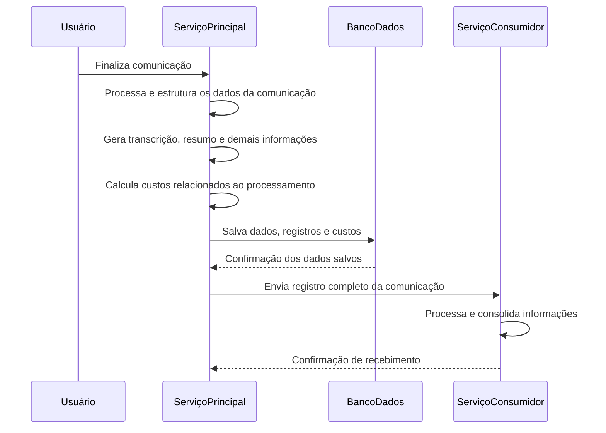
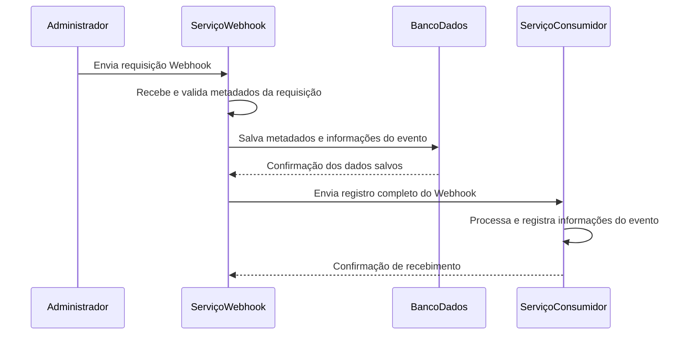

### 1. Características de Qualidade

- **Funcionalidade**
    - [Descreva a principal finalidade da feature e os comportamentos essenciais esperados do sistema.]
    - [Garantir que os perfis autorizados possam executar as ações primárias.]
    - [Garantir o rastreio e armazenamento de dados/logs quando aplicável.]
- **Usabilidade**
    - O processo de configuração e uso da funcionalidade deve ser intuitivo, claro e com feedbacks visuais claros (sucesso, pendente, erro).
    - Implementar validações impeditivas em tempo real nos campos editáveis com indicadores visuais claros (ex: borda vermelha para erros).
    - [Adicionar limitações de caracteres, debounce de requisições, comportamentos de formulários, live-previews ou modais de confirmação].
- **Responsividade**:
    - Deve realizar a criação das interfaces aplicando mobile-first
    - A interface de configuração (widget ou web) deve ser compatível com diversos tipos de dispositivos e telas.
    - A interface deve ser exibida de forma responsiva tanto em vertical quanto na horizontal
    - Garantir que durante a alteração do tamanho da tela os componentes da interface não sobreponham outros.
    
    | **Breakpoint**  | **Categoria Correspondente** |
    | --- | --- |
    | ≤576 px | Pequena |
    | 768 px | Média |
    | 992 px | Média |
    | 1200 px | Média |
    | ≥1600 px | Grande |

### 2. Mockups

**LINK FIGMA:** [URL_DO_FIGMA]

- **Desktop:** [Insira referência às telas Desktop]
- **Tablet:** [Insira referência às telas Tablet]
- **Mobile:** [Insira referência às telas Mobile]
- **Componentes:** [Modais, cards, previews ou bottom sheets]

### 3. ISO/IEC 29148:2011

#### 3.1 Requisitos do Usuário (RU)

1. **[RU01]** O usuário administrador deve ser capaz de [ação do usuário na interface].
2. **[RU02]** O usuário administrador deve ser capaz de visualizar [feedbacks/status/previews].
3. **[RU03]** O usuário deve ser alertado com mensagens de erro claras caso [condição de falha].

#### 3.2 Requisitos do Sistema (RS)

1. **[RS01]** O sistema deve implementar ou adaptar os microsserviços necessários para gerenciar [processo/integração].
2. **[RS02]** O sistema deve validar a estrutura do payload e tratar a entrada de dados em tempo de execução.
3. **[RS03]** O sistema deve deduplicar eventos e chamadas utilizando cache distribuído (ex: Redis).
4. **[RS04]** O sistema deve garantir a idempotência das operações no banco de dados.

#### 3.3 Requisitos de Resiliência (RES)

1. **[RES01]** O sistema deve aplicar estratégia de *retry* automático para erros transitórios (máximo de 3 tentativas).
2. **[RES02]** Utilização de *backoff* exponencial com *jitter* aleatório para evitar picos de carga.
3. **[RES03]** Uso de filas de mensagens com Dead Letter Queue (DLQ) para eventos falhos após esgotar o limite de *retries*.

### **4. IEEE 830-1998**

**Requisito Funcional 1:**

- **Descrição:** Implementar uma nova opção no menu lateral para acesso ao módulo de **Registro de Comunicações**
- **Prioridade:** Alta

**Requisito Funcional 2:**

- **Descrição:** Implementar uma nova opção no menu lateral para acesso ao módulo de **Registro de Eventos**
- **Prioridade:** Média

**Requisito Funcional 3:**

- **Descrição:** Implementar um campo de busca para localizar registros nos módulos de **Registro de Comunicações** e **Registro de Eventos**
- **Prioridade:** Baixa

### 5. Critérios de Aceitação e Fluxo alternativo

#### CA01: Acesso à funcionalidade

- **Dado que** o usuário administrador está autenticado e possui permissão de acesso, 
**Quando** acessar a funcionalidade,
**Então** o sistema deve apresentar a tela correspondente e disponibilizar as ações permitidas.
- **Fluxo alternativo:** Caso o usuário não possua permissão, o sistema deve impedir o acesso e apresentar uma mensagem informativa.

#### CA02: Visualização de informações

- **Dado que** o usuário administrador está na tela da funcionalidade,
**Quando** os dados forem carregados,
**Então** o sistema deve apresentar as informações disponíveis e seus respectivos status, quando aplicável.
- **Fluxo alternativo:** Caso ocorra uma falha no carregamento, o sistema deve apresentar uma mensagem informativa ao usuário.

#### CA03: Validação de dados

- **Dado que** o usuário está realizando uma operação,
**Quando** informar dados válidos,
**Então** o sistema deve aceitar os dados e permitir a continuidade da operação.
- **Fluxo alternativo:** Caso sejam informados dados inválidos ou campos obrigatórios não sejam preenchidos, o sistema deve impedir a operação e apresentar mensagens de erro claras.

### Fluxos Alternativos

| ID | Fluxo | Comportamento esperado |
| --- | --- | --- |
| FA01 | Usuário sem permissão | Acesso bloqueado e mensagem informativa |
| FA02 | Dados inválidos | Operação interrompida e erro apresentado |
| FA03 | Payload inválido | Requisição rejeitada |

### 6. Segurança (Conformidade OWASP Top 10)

- **A01:2021 – Broken Access Control**
    - Garantir validação de permissões granulares no backend (`bot_id`, `tenant_id`, papéis de usuário).
- **A02:2021 – Cryptographic Failures**
    - Armazenamento criptografado de segredos/tokens em repouso (ex: AES-256) e comunicação HTTPS/TLS 1.2+.
- **A03:2021 – Injection**
    - Sanitização de dados de entrada e metadados. Uso obrigatório de ORM ou *Prepared Statements*.
- **A04:2021 – Insecure Design**
    - Aplicação do Princípio do Menor Privilégio e controle rigoroso de cotas/limites de requisição.
- **A05:2021 – Security Misconfiguration**
    - Restrição de domínios permitidos em CORS e políticas rígidas de *Content-Security-Policy* (CSP).
- **A06:2021 – Vulnerable and Outdated Components**
    - Manutenção e varredura automatizada de vulnerabilidades nas dependências.
- **A07:2021 – Identification and Authentication Failures**
    - Uso de proteção Anti-CSRF (`state` token) e rota explícita de revogação de sessão/token.
- **A08:2021 – Software and Data Integrity Failures**
    - Verificação de integridade (MD5/Checksum) na transferência de arquivos e pipelines de integração.
- **A09:2021 – Security Logging and Monitoring Failures**
    - Logs estruturados no formato JSON (ex: biblioteca Pino / Encore Logger) contendo rastreabilidade contextual.
- **A10:2021 – Server-Side Request Forgery (SSRF)**
    - Validação e *allowlist* rígida de destinos para requisições externas (*outbound*).

### **7. RFC 9110** / **RFC 9111 -** HTTP status code

| **Action** | **Status** | **Detail** |
| --- | --- | --- |
| **Function Creation** | `201 Created` | Success when the function is registered to the agent by an Administrator or Manager. |
| **Function Execution** | `200 OK` | Success in processing the LLM request (Gemini/OpenAI) and returning the response. |
| **Access Validation** | `403 Forbidden` | Authenticated user lacks Administrator/Manager permissions for the action. |
| **Provider Switching** | `400 Bad Request` | Invalid request when trying to initialize the SDK with malformed credentials or `baseURL`. |
| **API Rate Limits** | `429 Too Many Requests` | Rate limit reached; triggers exponential backoff for up to 5 minutes. |
| **External Provider Error** | `502 Bad Gateway` | Communication failure between the chat-service and the Gemini/OpenAI API. |
| **Temporary Unavailability** | `503 Service Unavailable` | LLM provider is overloaded or under maintenance; triggers retries and backoff up to 10 min. |
| **Request Timeout** | `504 Gateway Timeout` | External server failed to respond in time; triggers the retry strategy. |
| **Permanent Failure** | `422 Unprocessable Content` | Semantic error in the function call preventing execution even with retries (send to DLQ). |

### 8. Modelagem de Dados

```sql
CREATE TABLE IF NOT EXISTS "external_integrations" (
  "id"                 uuid PRIMARY KEY DEFAULT gen_random_uuid() NOT NULL,
  "unit_id"            varchar(255) NOT NULL,
  "created_by_user_id" varchar(255),

  "external_user_id"   varchar(255) NOT NULL,
  "project_id"         varchar(64) NOT NULL,
  "app_slug"           varchar(64) NOT NULL,
  "account_id"         varchar(64) NOT NULL,
  "oauth_app_id"       varchar(64),

  "account_email"      varchar(320),
  "account_name"       varchar(255),
  "authorized_scopes"  jsonb NOT NULL DEFAULT '[]'::jsonb,

  "status"             varchar(20) NOT NULL DEFAULT 'pending',
  "healthy"            boolean NOT NULL DEFAULT true,
  "last_error"         text,

  "last_synced_at"     timestamptz,
  "created_at"         timestamptz NOT NULL DEFAULT now(),
  "updated_at"         timestamptz NOT NULL DEFAULT now(),
  "deleted_at"         timestamptz,

  CONSTRAINT "chk_external_integration_status"
    CHECK ("status" IN ('pending', 'connected', 'error', 'revoked'))
);

CREATE INDEX "idx_external_integrations_unit_id"
  ON "external_integrations" ("unit_id");

CREATE INDEX "idx_external_integrations_external_user_id"
  ON "external_integrations" ("external_user_id");

CREATE INDEX "idx_external_integrations_status"
  ON "external_integrations" ("status");

CREATE UNIQUE INDEX "unq_external_integrations_account"
  ON "external_integrations" ("unit_id", "account_id")
  WHERE "deleted_at" IS NULL;
```

### 9. BPMN (Business Process Model and Notation)

#### Fluxo de Registro de Comunicação



#### Fluxo de Registro de Webhook



### **10. Roteamento e Requisições**

### 10.1 Create - Registro de Comunicação

- **Requisitos:**
    - Deve criar todos os registros e detalhes referentes à comunicação realizada
- **Method:** `POST`
- **URL:** `https://api.exemplo.com/v1/communication-log`

**Exemplo de Payload de Entrada**

```json
{
  "agentId": "uuid-do-agente",
  "contact": "identificador-do-contato",
  "name": "Nome da comunicação",
  "totalCost": 0.25,
  "duration": 120,
  "createdAt": "2024-09-03T21:53:32.033Z",
  "mediaUrl": "https://exemplo.com/audio.mp3",
  "transcription": [
    {
      "role": "user",
      "time": 1744742922912,
      "endTime": 1744742924069,
      "message": "Mensagem enviada pelo usuário",
      "duration": 1156,
      "secondsFromStart": 7.36
    },
    {
      "role": "assistant",
      "time": 1744742925282,
      "endTime": 1744742940583,
      "message": "Resposta enviada pelo assistente",
      "duration": 13179,
      "secondsFromStart": 9.73
    }
  ],
  "summary": "Resumo gerado a partir da comunicação realizada."
}
```

**Exemplo de Resposta da Rota**

```json
HTTP/1.1 200 OK
Content-Type: application/json

{
  "id": "uuid-do-registro",
  "agentId": "uuid-do-agente",
  "contact": "identificador-do-contato",
  "name": "Nome da comunicação",
  "totalCost": 0.25,
  "duration": 120,
  "date": "2024-09-03T21:53:32.033Z",
  "mediaUrl": "https://exemplo.com/audio.mp3",
  "transcription": [
    {
      "role": "user",
      "time": 1744742922912,
      "endTime": 1744742924069,
      "message": "Mensagem enviada pelo usuário",
      "secondsFromStart": 7.36
    },
    {
      "role": "assistant",
      "time": 1744742925282,
      "endTime": 1744742940583,
      "message": "Resposta enviada pelo assistente",
      "secondsFromStart": 9.73
    }
  ],
  "summary": "Resumo da comunicação realizada."
}
```

### 10.2 Update - Registro de Comunicação

- **Requisitos:**
    - Deve atualizar todos os registros e detalhes referentes à comunicação realizada
- **Method:** `PUT`
- **URL:** `https://api.exemplo.com/v1/communication-log/:id`

**Exemplo de Payload de Entrada**

```json
{
  "agentId": "uuid-do-agente",
  "contact": "identificador-do-contato",
  "name": "Nome da comunicação",
  "totalCost": 0.25,
  "duration": 120,
  "createdAt": "2024-09-03T21:53:32.033Z",
  "mediaUrl": "https://exemplo.com/audio.mp3",
  "transcription": [
    {
      "role": "user",
      "time": 1744742922912,
      "endTime": 1744742924069,
      "message": "Mensagem enviada pelo usuário",
      "duration": 1156,
      "secondsFromStart": 7.36
    },
    {
      "role": "assistant",
      "time": 1744742925282,
      "endTime": 1744742940583,
      "message": "Resposta enviada pelo assistente",
      "duration": 13179,
      "secondsFromStart": 9.73
    }
  ],
  "summary": "Resumo gerado a partir da comunicação realizada."
}
```

**Exemplo de Resposta da Rota**

```json
HTTP/1.1 200 OK
Content-Type: application/json

{
  "id": "uuid-do-registro",
  "agentId": "uuid-do-agente",
  "contact": "identificador-do-contato",
  "name": "Nome da comunicação",
  "totalCost": 0.25,
  "duration": 120,
  "date": "2024-09-03T21:53:32.033Z",
  "mediaUrl": "https://exemplo.com/audio.mp3",
  "transcription": [
    {
      "role": "user",
      "time": 1744742922912,
      "endTime": 1744742924069,
      "message": "Mensagem enviada pelo usuário",
      "secondsFromStart": 7.36
    },
    {
      "role": "assistant",
      "time": 1744742925282,
      "endTime": 1744742940583,
      "message": "Resposta enviada pelo assistente",
      "secondsFromStart": 9.73
    }
  ],
  "summary": "Resumo da comunicação realizada."
}
```

### 10.3 GET All - Registro de Comunicação

- **Requisitos:**
    - Deve listar todos os registros de comunicação, dos mais recentes para os mais antigos
    - Deve identificar os registros vinculados aos agentes da unidade
- **Method:** `GET`
- **URL:** `https://api.exemplo.com/v1/communication-log/{unitId}`

**Exemplo de Payload de Entrada**

```bash
curl -X GET 'https://api.exemplo.com/v1/communication-log/unit_id' \
-H 'Authorization: Bearer <token>' \
-H 'X-CSRF-Token: <csrf_token>'
```

**Exemplo de Resposta da Rota**

```json
HTTP/1.1 200 OK
Content-Type: application/json

[
  {
    "id": "uuid-do-registro",
    "unitId": "uuid-da-unidade",
    "agentId": "uuid-do-agente",
    "contact": "identificador-do-contato",
    "name": "Nome da comunicação",
    "totalCost": 0.25,
    "duration": 120,
    "pageSize": 14,
    "completionType": "completed",
    "createdAt": "2024-09-03T21:53:32.033Z"
  }
]
```

### 10.4 GET by ID - Registro de Comunicação

- **Requisitos:**
    - Deve listar todas as informações do registro selecionado pelo usuário
- **Method:** `GET`
- **URL:** `https://api.exemplo.com/v1/communication-log/:id`

**Exemplo de Payload de Entrada**

```bash
curl -X GET 'https://api.exemplo.com/v1/communication-log/:id' \
-H 'Authorization: Bearer <token>' \
-H 'X-CSRF-Token: <csrf_token>'
```

**Exemplo de Resposta da Rota**

```json
HTTP/1.1 200 OK
Content-Type: application/json

{
  "id": "uuid-do-registro",
  "name": "Nome da comunicação",
  "agentId": "uuid-do-agente",
  "contact": "identificador-do-contato",

  "cost": {
    "llm": 0.25,
    "stt": 0.10,
    "media": 0.30,
    "summary": 0.15
  },

  "totalCost": 0.80,
  "duration": 120,
  "date": "2024-09-14T14:35:22Z",
  "mediaUrl": "https://exemplo.com/media.mp3",

  "transcription": [
    {
      "role": "user",
      "time": 1744742922912,
      "endTime": 1744742924069,
      "message": "Mensagem enviada pelo usuário",
      "duration": 1156,
      "secondsFromStart": 7.36
    },
    {
      "role": "assistant",
      "time": 1744742925282,
      "endTime": 1744742940583,
      "message": "Resposta enviada pelo assistente",
      "duration": 13179,
      "secondsFromStart": 9.73
    }
  ],

  "summary": "Resumo da comunicação realizada.",

  "customData": {
    "field1": "valor configurado",
    "field2": 20,
    "field3": "valor adicional"
  },

  "metadata": {
    "communicationId": "uuid-do-registro",
    "duration": 120,
    "language": "pt-BR",
    "timestamp": "2024-09-14T14:35:22Z",
    "mediaUrl": "https://exemplo.com/media.mp3"
  }
}
```

### 10.5 DELETE - Registro de Comunicação

- **Requisitos:**
    - Deve remover os registros de comunicação associados a uma unidade após sua exclusão
    - A exclusão deve ocorrer de forma encadeada, respeitando as regras de integridade dos dados
- **Method:** `DELETE`
- **URL:** `https://api.exemplo.com/v1/communication-log/{unitId}`

**Exemplo de Payload de Entrada**

```bash
curl -X DELETE 'https://api.exemplo.com/v1/communication-log/:unit_id' \
-H 'Authorization: Bearer <token>' \
-H 'X-CSRF-Token: <csrf_token>'
```

**Exemplo de Resposta da Rota**

```json
HTTP/1.1 200 OK
Content-Type: application/json

{
  "success": true,
  "message": "Registros removidos com sucesso."
}
```

### 11. Plano de teste

#### 11.1 Objetivo

- Validar de ponta a ponta a implementação de uma integração com um serviço externo, garantindo a fluidez da configuração no painel administrativo (Fluxo Admin) e a correta utilização dos recursos integrados pelo sistema ou agente de IA em ambiente de execução (Runtime).
- Assegurar que o processo de autenticação e autorização seja concluído corretamente e que as informações da conta externa sejam apresentadas e armazenadas de forma adequada.
- Validar o funcionamento das operações disponibilizadas pela integração, considerando diferentes cenários de sucesso, erro e indisponibilidade do serviço externo.
- Garantir a conformidade com requisitos de segurança, isolamento multitenant, acessibilidade (a11y), internacionalização (i18n), responsividade e resiliência das chamadas realizadas à API externa.

#### 11.2 Pré-condições

- Ambientes de backend e frontend atualizados e operacionais.
- Serviço e rotas responsáveis pela integração externa devidamente configurados com as respectivas credenciais e chaves de acesso.
- Conta de testes do serviço externo ativa e com dados suficientes para realização das validações.
- Massa de dados configurada para contemplar diferentes cenários de utilização.
- Pelo menos dois *tenants* distintos configurados para validação do isolamento dos dados.
- Usuário administrador previamente cadastrado e com as permissões necessárias para configurar integrações.
- Recurso, agente ou funcionalidade que utilizará a integração previamente cadastrado e disponível para testes.
- Ferramentas de QA disponíveis, como DevTools do navegador para monitoramento das requisições, responsividade e console, além de Postman/Insomnia para testes diretos das APIs.
- Credenciais de teste disponíveis para validação dos fluxos de autenticação, autorização e revogação de acesso.

#### 11.3 Casos de Teste

#### T01 - Fluxo 1: Criação e Configuração da Integração (E2E Admin)

| **Campo** | **Descrição** |
| --- | --- |
| **Pré-condição** | Administrador autenticado no painel web com acesso ao recurso responsável pela configuração de integrações. |
| **Ação** | 1. Acessar o recurso de gerenciamento de integrações.
2. Clicar em "Criar nova integração".
3. Selecionar o serviço externo desejado.
4. Informar os dados necessários para identificação e utilização da integração.
5. Clicar em "Conectar conta".
6. Realizar o processo de autenticação e autorização no serviço externo.
7. Retornar ao painel administrativo.
8. Verificar o status da conexão.
9. Selecionar as operações que estarão disponíveis para utilização.
10. Clicar em "Salvar". |
| **Resultado esperado** | • O formulário é apresentado corretamente, com textos de apoio, labels e placeholders esperados.
• O fluxo de autenticação é iniciado corretamente.
• A autorização é concluída sem erros.
• As informações da conta autenticada são apresentadas corretamente após o retorno ao sistema.
• O status da integração é atualizado para "Conectado".
• As operações selecionadas são salvas corretamente.
• A integração é associada exclusivamente à unidade/tenant do administrador autenticado.
• A configuração permanece disponível após atualizar a página. |

### T02 - Validação de Operações Disponíveis

| **Campo** | **Descrição** |
| --- | --- |
| **Pré-condição** | Integração conectada e com diferentes operações configuradas. |
| **Ação** | 1. Acessar a configuração da integração.
2. Habilitar uma operação específica.
3. Salvar a configuração.
4. Utilizar o recurso consumidor.
5. Executar a operação habilitada.
6. Desabilitar a operação.
7. Salvar novamente.
8. Tentar executar a mesma operação. |
| **Resultado esperado** | • Apenas as operações habilitadas ficam disponíveis para utilização.
• Alterações nas operações são persistidas corretamente.
• Operações desabilitadas não podem ser executadas pelo recurso consumidor.
• O sistema apresenta uma mensagem adequada quando uma operação indisponível é solicitada. |

### T04 - Fluxo 4: Erro durante a Autenticação

| **Campo** | **Descrição** |
| --- | --- |
| **Pré-condição** | Administrador autenticado e integração disponível para configuração. |
| **Ação** | 1. Iniciar o processo de conexão com o serviço externo.
2. Interromper ou cancelar o processo de autenticação.
3. Retornar ao painel administrativo. |
| **Resultado esperado** | • O sistema identifica que a autenticação não foi concluída.
• A integração não é apresentada como conectada indevidamente.
• O status permanece como pendente ou é atualizado para o estado de erro correspondente.
• O usuário recebe uma mensagem clara orientando sobre o próximo passo.
• Nenhum registro incompleto ou credencial inválida é persistido indevidamente. |

### **12. Acessibilidade (a11y)**

1. **Navegação por Teclado**: Garantir que todos os elementos de formulário, listagem e busca sejam acessíveis via teclado.

2. **Compatibilidade com Leitores de Tela**: As informações de configurações e feedback de erro devem ser compatíveis com leitores de tela.

3. **Contraste de Cores**: Assegurar contraste adequado entre texto e fundo.

4. **Rótulos de Formulário**: Incluir rótulos claros para todos as integrações, modais e botões.

5. **Parâmetros Padrão:** WCAG 2.1 Acessibilidade para Conteúdo Web

### **13. Internacionalização (i18n)**

1. **Suporte a Idiomas**: A interface e as mensagens de feedback devem estar disponíveis em vários idiomas (ex: português, inglês, espanhol).

2. **Detecção de Localidade**: O sistema deve detectar e ajustar automaticamente o idioma com base nas configurações do navegador do usuário.

### **14. Impacto Geral**

- A implementação dos **registros de comunicação** diretamente na plataforma facilita o monitoramento das interações entre os usuários e os serviços, permitindo identificar e analisar possíveis falhas durante o processo.
- A implementação dos **registros de eventos** diretamente na plataforma facilita o monitoramento das integrações realizadas por meio de APIs, proporcionando maior visibilidade sobre as requisições, respostas e possíveis erros de comunicação entre os sistemas.
